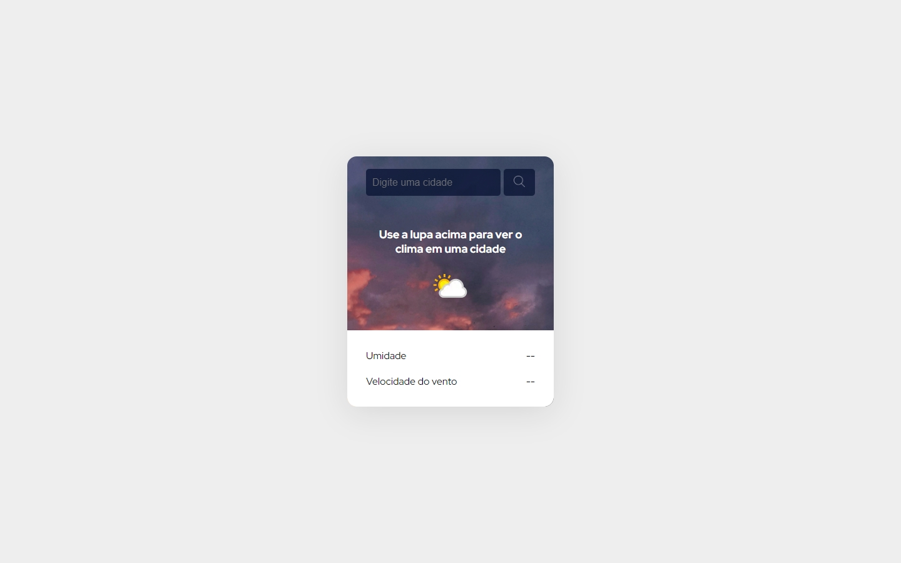

<h1 align="center">Projeto API Clima</h1>

  
Um projeto simples de busca de clima utilizando API, créditos aos  <a href="https://www.youtube.com/@DevemDobro">Dev em Dobro</a> pelo apoio ao projeto.

  <a href="#-tecnologias">Tecnologias</a>&nbsp;&nbsp;&nbsp;|&nbsp;&nbsp;&nbsp;
  <a href="#-projeto">Projeto</a>

  

## 🚀 Tecnologias

Esse projeto foi desenvolvido com as seguintes tecnologias:

- HTML e CSS
- JavaScript
- Git e Github
- Weather API

## 💻 Projeto

Objetivo desse projeto é aplicar o uso da API utilizando JavaScript, com foco em aprender a dominar o uso de API's

- [Acesse o projeto finalizado, online.](https://phdiias.github.io/projeto-api-clima/)
